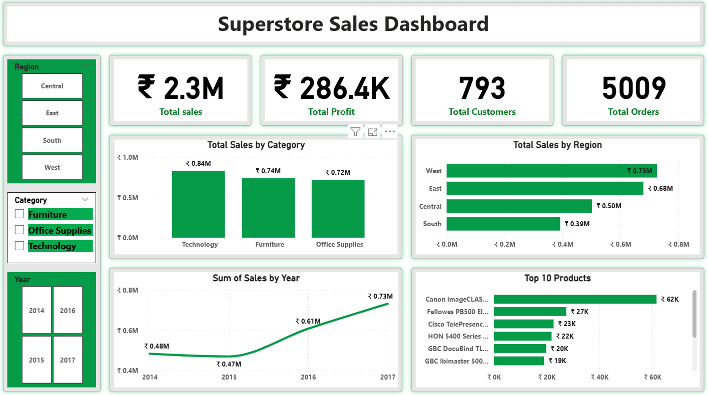

📊 Superstore Sales Dashboard (Power BI)
## 📌 Project Overview

This project presents an interactive Sales Dashboard built using Power BI to analyze retail business performance.

The dashboard helps stakeholders monitor key metrics such as Sales, Profit, Customers, and Orders, enabling better data-driven decision-making.

## 🎯 Objectives

- Track overall business performance  
- Identify top-performing categories and regions  
- Analyze sales trends over time  
- Discover top-selling products  

## 🛠️ Tools & Technologies

- Power BI  
- Data Cleaning & Transformation  
- Data Modeling  
- DAX (Data Analysis Expressions)  

## 📂 Dataset

- Superstore Dataset (Retail Sales Data)  
- Contains: Orders, Customers, Products, Region, Sales, Profit  
- Source: Kaggle / Public datasets  

## 📊 Dashboard Features

- KPI Cards (Total Sales, Profit, Customers, Orders)  
- Sales by Category  
- Sales by Region  
- Year-wise Sales Trend  
- Top 10 Products  
- Interactive Filters (Region, Category, Year)  

## 📈 Key Insights

- Technology category generated the highest sales  
- West region is the top-performing region  
- Sales increased significantly after 2015  
- Top products contribute a major portion of total revenue  

## 📷 Dashboard Preview

## 💡 Business Impact

- Helps identify high-performing products and regions  
- Supports data-driven decision making  
- Improves business strategy and performance tracking  

## 📚 Learnings

- Data cleaning and preprocessing techniques  
- Writing efficient DAX calculations  
- Building interactive dashboards  
- Converting data into meaningful insights  

## 🚀 Future Improvements

- Add sales forecasting  
- Implement customer segmentation  
- Deploy dashboard to Power BI Service  

## 👨‍💻 Author

**Anil Kumar**  
Data Analyst  

---
